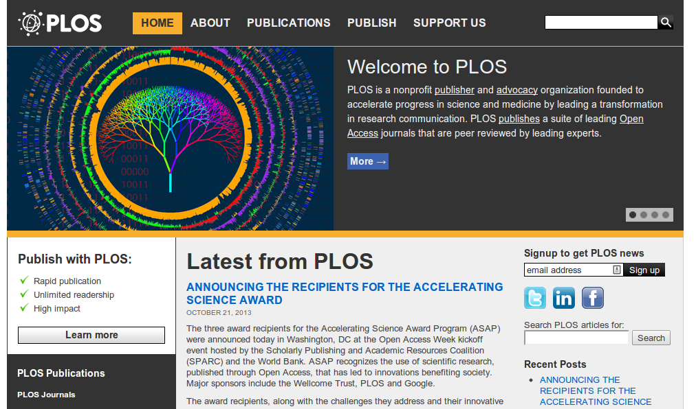
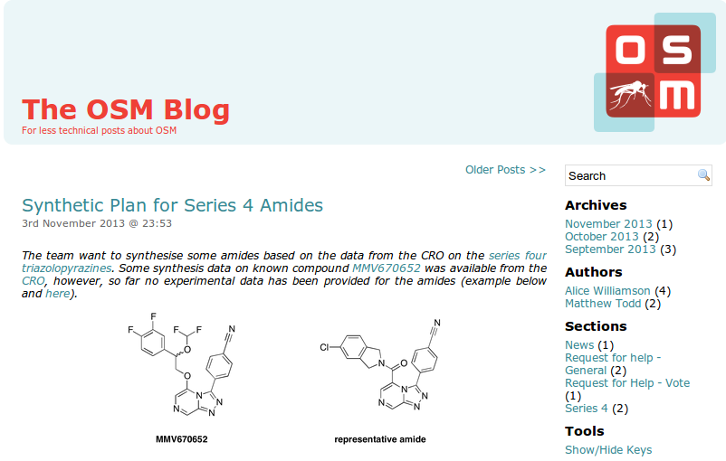
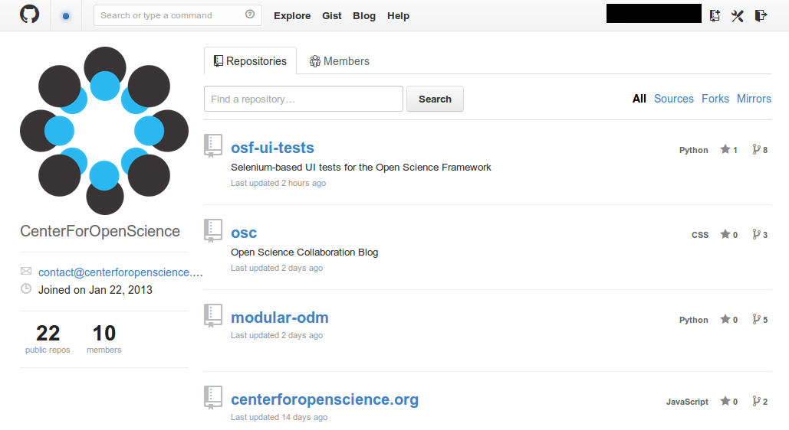
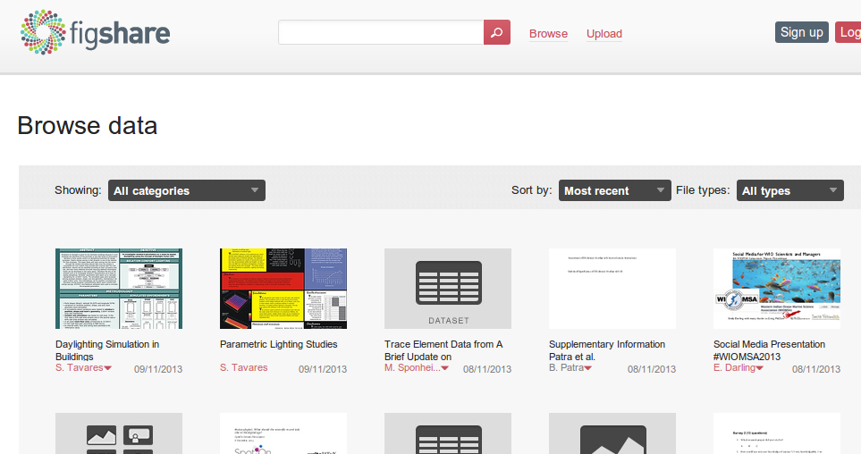
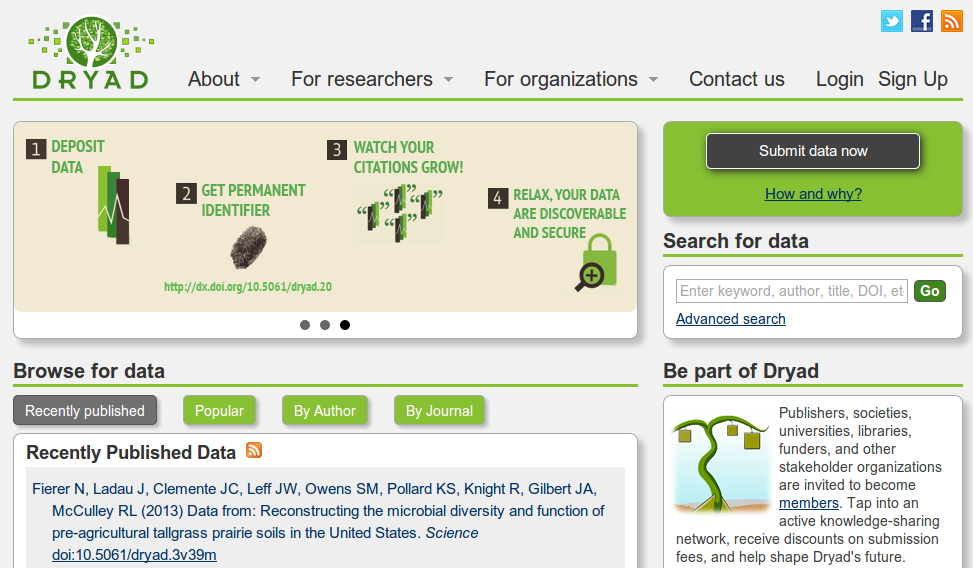
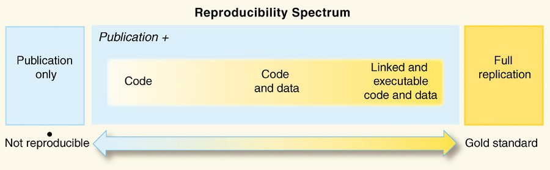

## Agenda

> - La Ciencia, su metodología y filosofía
> - Ciencia y Código Libre/Abierto
> - Tendencias
> 	- Acceso Abierto (*Open Access*)
>  	- Ciencia Abierta (*Open Science*)
>  	- Investigación Reproducible (*Reproducible Research*)

---

## Ciencia - Definición

<q>
La actividad intelectual y práctica que involucra el estudio sistemático de
la estructura y comportamiento del universo, a través de la observación
y experimentación.
</q>

<div class="footer">Scientia (latin): Conocimiento</div>

--- 

## Método científico

> 1. Observación objetiva (mediciones y datos)
> 2. Formulación del problema (considerar la evidencia)
> 3. Generación de Hipótesis (explicar lo observado)
> 4. Derivación de Predicciones cuantificables
> 5. Experimentación/Prueba (basado en la predicción)
> 6. Análisis de los resultados (escrutinio y valoración)

---

<q>La Ciencia no nos da la verdad absoluta, la ciencia es un mecanismo. Es un
modo de mejorar nuestro conocimiento de la naturaleza, un sistema para
contrastar nuestros pensamientos con el universo y ver si coinciden.
<div class="author">Isaac Asimoc</div>
</q>

---

## Hipótesis científica

- Provee una explicación de los fenómenos observados, la cual tiene que ser
  comprobada fehacientemente.
- Idealmente tiene que:
    - Poder explicar fenómenos futuros (poder predictivo)
	- Evitar la complejidad excesiva y sin razón ("*Navaja de Occam*")
	- Ser cuantificable y comprobable
	- Tener un alcance definido

--- 

## El cuento de la oveja negra

Tres amigos estaban viajando en un tren: un abogado, un físico y un matemático.

> - El abogado vio por la ventana y dijo: "Las ovejas de esta región son negras"
> - El físico dijo: "No, eso es incorrecto: _algunas_ ovejas de esta región son negras"
> - El matemático, algo molesto dijo: "Hay al menos un campo en esta región, conteniendo al menos una oveja, la cual tiene al menos un lado de color negro"

---

## Teoría científica

- Una explicación comprobada de algún aspecto de la naturaleza.
- La comprobación debe haber sido repetida y repetible en forma independiente,
  a través de la observación y la experimentación.
- Puede hacer predicciones que pueden ser probadas falsas
  (_falsificable_/_falseable_)
- Es consistente con teorías científicas pre-existentes.

---

## Falseabilidad en Ciencia

> - Un concepto central: _la inherente posibilidad de comprobar
>   (experimentalmente) que una afirmación (hipótesis o teoría) acerca del
>   comportamiento de la naturaleza, resulta ser **falsa**_ 
> - En su forma menos dura: "*la afirmación resulta ser incompleta*"
> - Esto implica que los científicos tienen que estar dispuestos a aceptar
>   teorías nuevas que expliquen mejor lo observado

---

<q>Toda la Ciencia es incierta y sujeta a revisión. Lo glorioso de la ciencia
es el (*poder*) imaginar más de lo que podemos probar.
<div class="author">Freeman Dyson</div>
</q>

--- .segue

## Ciencia \(\iff\) Código Libre

---

## El quehacer científico

- El trabajo en Ciencia es inherentemente colaborativo
- Implica compartir libremente lo aprendido
- Uso de un lenguaje común, concreto y preciso
- Experiencia resumida en un conjunto de teorías
- Muchas comunidades pero los mismos objetivos
- Se fundamenta en la meritocracia

---

## Discusión abierta

- Revisión crítica de resultados, hipótesis y teorías
- Revisión de (tus) publicaciones por (tus) pares
- Mecanismos para la retracción de publicaciones
- Objetividad y pragmatismo como presupuestos

---

## Mejoras continuas

- Los avances se basan en conocimiento pre-existente
- Refinamiento de hipótesis y teorías, frente a nuevos resultados
- Avances (y retrocesos) en investigación interdisciplinaria
- Ocasionalmente, cambios paradigmáticos

---

<q>La Ciencia es una forma de pensar y no solamente un conjunto de
conocimientos acumulados.
<div class="author">Carl Sagan</div>
</q>

--- .segue

## Acceso Abierto (Open Access)

---

## Inicios de Acceso Abierto

- Budapest Open Access Initiative (2002)
   - http://www.budapestopenaccessinitiative.org/read
- Bethesda Statement on Open Access Publishing (2003)
   - http://dash.harvard.edu/handle/1/4725199
- Berlin Declaration on Open Access to Knowledge in the Sciences and Humanities
  (2003)
   - http://openaccess.mpg.de/286432/Berlin-Declaration

---

## Definición de Acceso Abierto

<q>\(\ldots\)Por 'acceso abierto'\(\ldots\)queremos decir su disponibilidad
gratuita en Internet público, permitiendo a cualquier usuario leer, descargar,
copiar, distribuir, imprimir, buscar o usarlos con cualquier propósito legal,
sin ninguna barrera financiera, legal o técnica\(\ldots\)
<div class="author">Definición de Budapest (2002)</div>
</q>

---

## Copyright en Acceso Abierto

<q>\(\ldots\)La única limitación en cuanto a reproducción y distribución  y el
único rol del copyright en este dominio, deberá ser dar a los autores el
control sobre la integridad de sus trabajos y el derecho de ser adecuadamente
reconocidos y citados\(\ldots\)
<div class="author">Definición de Budapest (2002)</div>
</q>

---

## Acceso Abierto

- Acceso en línea, libre, inmediato y permamente a toda la información
  científica y técnica que se publica.
- Incluye: artículos en revistas, libros, bases de datos, etc.
- Favorece a todos: Autores, Instituciones y al Público en General
- Un movimiento que comenzó hace una década (~2003)
- Ha pasado a ser el modo aceptable y aceptado de publicar

---

## Publicando en Acceso Abierto

- Políticas de publicación abierta de entidades financiadoras,
  universidades, etc. (ej: http://publicaccess.nih.gov/)
- Muchas compañías editoras dan ahora la posibilidad de publicar en Acceso
  Abierto
- Recursos:
    - Reg. of Open Access Rep. (ROAR): http://roar.eprints.org/
	- ROARMAP (Mandates): http://roarmap.eprints.org/
	- DOAJ: http://www.doaj.org/

---

## PLOS (http://www.plos.org/)



---

## BMJ (http://www.bmj.com/)


--- 

## La importancia de Acceso Abierto

<q>Open Knowledge [saves
lives](http://blogs.ch.cam.ac.uk/pmr/2011/10/24/open-access-saves-lives/) 
\(\ldots\)<br/>
Closed access means people die
<div class="author">[Peter
Murray-Rust](http://blogs.ch.cam.ac.uk/pmr/2011/10/23/open-research-reports-what-jenny-and-i-said-and-why-i-am-angry/)</div></q>


--- .segue

## Ciencia Abierta (Open Science)

---

## ¿Que es "Ciencia Abierta"?

- Un término general que incluye
    - Publicar en Acceso Abierto
	- Conducir investigación en forma abierta al estilo de los proyectos de
	  Código Libre/Abierto (**Open Research**)
    - Mantener los registros primarios
	  de la investigación en forma pública (**Open Notebook Science**)

---

## The Synaptic Leap

- Un espacio para las comunidades que activamente hacen investigación biomédica
- Comunidades
    - Malaria
	- Esquistosomiasis
	- Tuberculosis
	- Toxoplasmosis
- Basado en Drupal
- URL: http://www.thesynapticleap.org

---

## Open Wetware

- "OpenWetWare is an effort to promote the sharing of information,
  know-how, and wisdom among researchers and groups who are working in biology
  & biological engineering."
- "Cuadernos" de laboratorio electrónicos, abiertos a todo el mundo
- Basado en Mediawiki
- URL: http://openwetware.org

---

## Las "[reglas](http://openwetware.org/wiki/Open_Source_Drug_Discovery)" de la Ciencia Abierta

1. Todos los datos son abiertos y las ideas se comparten
2. Cualquier persona puede participar en cualquier nivel del proyecto
3. No habrán patentes
4. Las sugerencias son las mejores formas de criticar
5. La discusión pública es mucho más valiosa que las comunicaciones privadas
6. El proyecto es más grande que, y no es de propiedad de, un laboratorio en
   particular. El objetivo es encontrar una cura, por cualquier medio, tan
   pronto como sea posible.

---

## Open Source Malaria (OSM)

- Comunidad internacional abierta, con el objetivo de encontrar una cura para
  la malaria
- No importa tu nivel de conocimiento o experiencia, lo que importa es que
  quieras ayudar
- Ejemplo de Open Source Drug Discovery
- URL: http://opensourcemalaria.org/

---

## Labtrove

- Aplicativo web que permite a los investigadores el compartir directamente,
  sus planes experimentales, pensamientos, observaciones, y resultados con una
  amplia comunidad en línea, en una forma semáticamente rica y extensible.
- Hecho por la Universidad de Southampton
- URL: http://www.labtrove.org/
- Código: http://sourceforge.net/projects/labtrove/

---

## [OSM Blog](http://malaria.ourexperiment.org/the_osm_blog)



---

## Open Science Framework

- Un sistema para archivar materiales de investigación, con un componente
  colaborativo y de control de versiones
- Incluye el manejo de los documentos, datos, etc. y del flujo de trabajo del
  proyecto de investigación científica
- URL: https://openscienceframework.org
- En github: https://github.com/OpenScienceFramework

---

## [Center for Open Science](https://github.com/centerforopenscience)




---

## figshare (http://figshare.com)



---

## DRYAD (http://datadryad.org/)



---

## Otros recursos y referencias

- [We need a github of science](http://marciovm.com/i-want-a-github-of-science/)
- [GitHub for Academics...](http://blogs.lse.ac.uk/impactofsocialsciences/2013/06/04/github-for-academics/)
- [Open Science Project](http://www.openscience.org/blog/)
- [ROpenSci](http://ropensci.org/)
- [Open Knowledge Foundation](http://okfn.org/)
- [Open Source Drug Discovery](http://www.osdd.net/) (India)

--- .segue

## Investigación Reproducible<br/><br/>(Reproducible Research)

---

## Objetivo

- El poder reproducir en su totalidad investigación publicada, para poder entenderla mejor y verificarla.
- Implica el tener acceso a:
    - Los datos experimentales (crudos y/o procesados)
	- El flujo de trabajo de proceso de los datos
	- Los algoritmos y transformaciones empleadas
	- El software empleado para el análisis

---

## El "espectro" de reproducibilidad



(Roger Peng)

---

## Como se está implementando

- Publicación de datos, código e instrucciones (ej. en github)
- Software empleado:
    - **R**: para el análisis de datos
	- **\(\LaTeX\)** y/o **Markdown**: para la documentación
	- **knitr**: para integrar documentación y código (\(\LaTeX\) + R)
	- **slidify**: Markdown + R a HTML
	- **RStudio**: Markdown o \(\LaTeX\) + R
	- **git**: control de versiones

---

## Markdown + Math (\(\LaTeX\))

~~~ latex
$$
\begin{align}
\dot{x} & = \sigma(y-x) \\
\dot{y} & = \rho x - y - xz \\
\dot{z} & = -\beta z + xy
\end{align}
$$
~~~

$$
\begin{align}
\dot{x} & = \sigma(y-x) \\
\dot{y} & = \rho x - y - xz \\
\dot{z} & = -\beta z + xy
\end{align}
$$

---

## Markdown + R


``` {r scplot, dev = 'png', fig.width = 8, fig.height = 5, error = T}
library(ggplot2)
library(ggthemes)
qplot(wt, mpg, data = mtcars) + theme_solarized()
```

---

## Recursos y referencias

- [Reproducible research and Biostatistics](http://biostatistics.oxfordjournals.org/content/10/3/405.full) (doi: 10.1093/biostatistics/kxp014)
- [Reproducible Research in Computational Science](http://www.sciencemag.org/content/334/6060/1226.full) (doi: 10.1126/science.1213847)
- Reproducible Research (CRAN): http://cran.r-project.org/web/views/ReproducibleResearch.html 
- [Treading a New Path for Reproducible Research: Part 1](http://simplystatistics.org/2013/08/21/treading-a-new-path-for-reproducible-research-part-10/)
- [Open Science Paper @ github](https://github.com/cpfaff/Open-Science-Paper)

---

<q>One thing I have learned in a long life: that all our science, measured
against reality, is primitive and childlike — and yet it is the most precious
thing we have.
<div class="author">Albert Einstein</div>
</q>

--- .thank-you-slide .segue

## ¡Muchas Gracias!

- Jesús M. Castagnetto (jesus@upch.pe)
- Esta charla: http://jmcastagnetto.github.io/20131109-ciencia_y_floss-apesol_uni/
- Repositorio: https://github.com/jmcastagnetto/20131109-ciencia_y_floss-apesol_uni/
